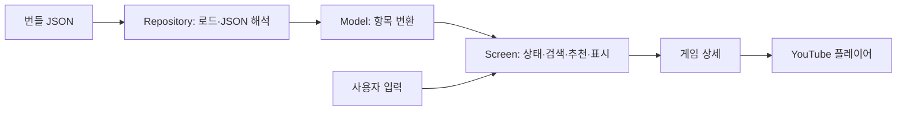

> 공개 데모 기준 문서입니다. Wi-Fi·QR·이미지·폰트·게임 위치와 메뉴 가격은 데모용으로 교체했으며 운영 배포 설정은 제외했습니다.

# 구조와 사용자 흐름

## 서비스 범위

몽몽플레이는 게임 탐색과 매장 정보 조회를 제공하는 Flutter 클라이언트입니다. 데이터 저장 서버나 로그인 과정 없이 번들 데이터를 사용합니다. 게임·메뉴 데이터 조회는 네트워크 요청이 필요하지 않지만, YouTube 영상 재생은 외부 서비스에 의존합니다.

## 디렉터리

```text
lib/
├── main.dart
├── models/
│   ├── game_item.dart
│   └── menu_item.dart
├── repositories/
│   ├── game_repository.dart
│   └── menu_repository.dart
└── screens/
    ├── game_search_screen.dart
    ├── game_recommend_screen.dart
    ├── game_detail_screen.dart
    ├── menu_screen.dart
    ├── guide_screen.dart
    ├── sns_wifi_screen.dart
    └── event_screen.dart
assets/
├── db/
│   ├── games.json
│   └── menus.json
├── fonts/
└── images/
test/
└── widget_test.dart
```

## 역할과 데이터 흐름



| 위치 | 역할 |
| --- | --- |
| main.dart | 앱 테마, 홈 화면, 각 기능 화면으로의 이동 |
| GameRepository / MenuRepository | rootBundle로 JSON 파일을 읽고 Model 목록 생성 |
| GameItem / MenuItem | JSON 값 변환, 이미지 경로 및 표시용 텍스트 제공 |
| GameSearchScreen | 데이터 로딩, 검색·필터·추천 계산, 목록 표시 |
| GameRecommendScreen | 인원·분위기·난이도·시간 선택, 추천 모드로 검색 화면 호출 |
| GameDetailScreen | 게임 정보와 영상 표시, 플레이어 생성 및 종료 |
| MenuScreen | 메뉴 로딩, 카테고리별 표시, 스크롤과 선택 카테고리 연동 |
| 나머지 안내 화면 | 코드 및 이미지에 정의된 매장 안내 내용 표시 |

Repository와 Model은 분리되어 있지만, 별도 Service 계층이나 상태 관리 패키지는 사용하지 않습니다. 추천 계산도 현재 Screen 내부에 있습니다.

## 사용자 흐름

### 게임 검색

홈 → 보드게임 찾기 → 이름 검색 또는 필터 설정 → 게임 카드 선택 → 게임 상세.

검색어와 게임 이름에서 공백을 제거하고 소문자로 변환한 뒤 부분 일치 여부를 확인합니다. 일반 검색은 선택한 필터를 모두 만족하는 항목을 표시합니다. 인원 필터는 실제 플레이 가능 범위가 아니라 **recommendedPlayer**를 기준으로 합니다.

### 게임 추천

홈 → 보드게임 추천 → 필수 인원 선택 → 선택 조건 입력 → 추천게임 찾기 → 추천 결과 → 게임 상세.

분위기는 장르로 변환되고, 선택하지 않은 난이도·시간·분위기는 '전체'로 전달됩니다. GameSearchScreen을 recommendationMode로 열어 같은 목록 UI를 사용합니다. 계산 규칙은 [추천 문서](recommendation.md)에 설명되어 있습니다.

### 메뉴 탐색

홈 → 메뉴 보기 → 카테고리 선택 → 해당 섹션으로 스크롤.

스크롤 위치에 따라 선택 카테고리를 갱신하며, 메뉴의 sub_category가 있으면 해당 값을 표시 카테고리로 사용합니다.

## 상태와 자원 관리

- 검색·추천·메뉴 화면은 StatefulWidget과 setState를 사용합니다.
- 데이터 로딩은 화면 초기화 시 비동기로 수행하며, 로드 완료 후 mounted를 확인합니다.
- 검색 TextEditingController와 메뉴 ScrollController는 dispose에서 정리합니다.
- 상세 화면은 영상 ID가 있을 때 YouTube 컨트롤러를 만들고 dispose에서 종료합니다.
- 뒤로 이동은 Navigator.pop, 홈 이동은 최초 route까지 pop하는 방식입니다.

## 화면 구성

LayoutBuilder, MediaQuery, Expanded, ConstrainedBox 등을 사용해 크기와 배치를 계산합니다. 여러 요소가 화면 너비·높이에 비례하고 가로 Row로 구성되므로, 대화면 비율 조절과 작은 세로 화면에 대한 적응형 레이아웃은 구분해서 검증해야 합니다.

현재 홈 위젯 테스트의 화면 크기는 1920×1080입니다. 실제 태블릿·모바일·키오스크 기기에서의 사용성과 접근성은 별도 확인이 필요합니다.

## 구조상 개선 지점

1. 추천 점수 계산을 화면 밖으로 분리하면 UI 없이 경계 조건을 테스트할 수 있습니다.
2. JSON 로딩 중 예외가 발생하면 현재 성공 경로의 isLoading 해제에 도달하지 못합니다. 오류 상태 표시와 재시도 처리가 필요합니다.
3. 화면 파일 내부의 반복 UI는 변경이 반복되는 부분부터 공통화할 수 있습니다. 현재 구조를 완성된 계층형 아키텍처로 표현하지 않습니다.
